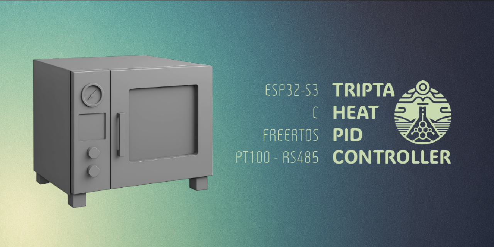
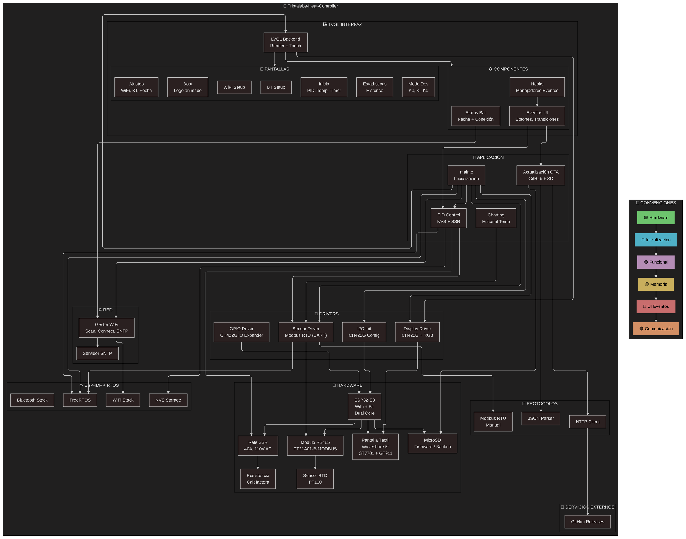
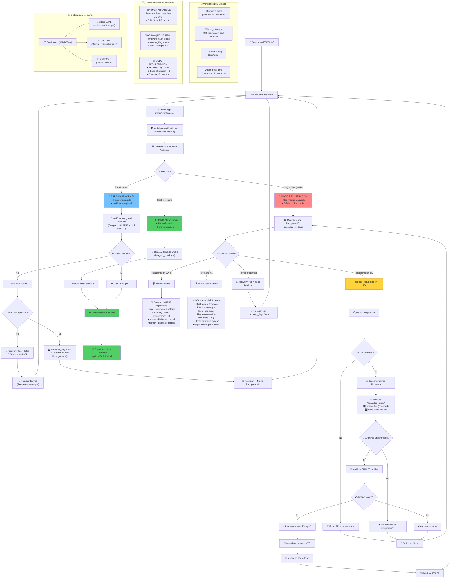
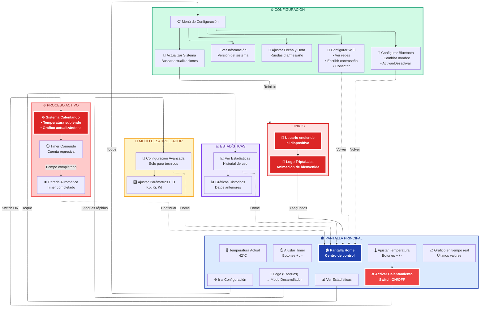

# 🔥 TriptaLabs Heat Controller

**Controlador inteligente industrial para horno de vacío**, desarrollado por TriptaLabs, basado en ESP32-S3 con **bootloader personalizado**, interfaz táctil avanzada y sistema de actualización OTA innovador. 

> 🎯 **Proyecto de nivel industrial** con arquitectura robusta, verificación de integridad SHA256, recuperación automática y control PID profesional.

[](https://docs.espressif.com/projects/esp-idf/)
[](https://lvgl.io/)
[](LICENSE)

---

## 🧪 Descripción General

Este sistema implementa un **controlador profesional de horno de vacío** que combina hardware industrial con software de nivel producción. A diferencia de proyectos típicos de ESP32, incluye características avanzadas como:

### ✨ Características Principales

* 🛡️ **Bootloader personalizado** con verificación SHA256 y recuperación automática
* 🎛️ **Control PID avanzado** con parámetros configurables y anti-windup
* 🌡️ **Lectura precisa PT100** vía **Modbus RTU** implementado manualmente
* 📡 **Actualización OTA innovadora** directa sobre partición única (sin OTA estándar)
* 🖼️ **Interfaz táctil profesional** con LVGL y modo desarrollador secreto  
* 📊 **Sistema de estadísticas** y monitoreo de sesiones
* 🔧 **Modo recovery** con interfaz UART para mantenimiento
* 🌐 **Conectividad dual** WiFi + Bluetooth con sincronización NTP

---

## 🏗️ Arquitectura del Sistema

El sistema implementa una arquitectura modular robusta con separación clara de responsabilidades:



---

## 🛡️ Bootloader Personalizado y Sistema de Recuperación

Una de las características más innovadoras del proyecto es su **bootloader personalizado** que proporciona verificación de integridad y recuperación automática:

### 🔐 Características del Bootloader

* **Verificación SHA256** del firmware en cada arranque
* **Contadores de fallos** con límite de 3 intentos
* **Recuperación automática** desde microSD
* **Modo recovery manual** con interfaz UART
* **Estadísticas persistentes** en NVS



### 🚨 Modo Recovery

El sistema incluye un **modo recovery avanzado** accesible mediante:
- **Automático**: Después de 3 fallos de arranque consecutivos
- **Manual**: Mediante comando UART o flag en NVS
- **Interfaz UART**: Comandos `info`, `recovery`, `reboot`, `factory`

---

## 💾 Sistema de Actualización OTA Innovador

A diferencia de las implementaciones OTA estándar de ESP-IDF, este proyecto utiliza un **enfoque único**:

### 🎯 Características del OTA

* **Partición única** (app0) - Sin particiones OTA dedicadas
* **Actualización directa** flasheando sobre app0 desde bootloader
* **Descarga desde GitHub** con verificación JSON
* **Backup automático** en microSD antes de actualización
* **Rollback seguro** en caso de fallo

### 📋 Tabla de Particiones

```csv
# Name,        Type, SubType, Offset,  Size,     Notes
nvs,           data, nvs,     0x9000,  0x100000, # Config + Boot vars
app0,          app,  factory, 0x110000, 0xA00000, # Main application  
spiffs,        data, spiffs,  ,        0x200000, # User data
```

### 🔄 Flujo de Actualización

```mermaid
flowchart TD
    A[App descarga update.bin] --> B[Guarda en /sdcard/update.bin]
    B --> C[pending_update = true en NVS]
    C --> D[esp_restart()]
    D --> E[Bootloader detecta flag]
    E --> F[Verifica SHA256 del archivo]
    F --> G[Flashea app0 completo]
    G --> H[Actualiza hash en NVS]
    H --> I[pending_update = false]
    I --> J[Reinicia a nueva versión]
    
    style A fill:#e1f5fe
    style G fill:#ff8a65
    style J fill:#81c784
```

---

## 🎛️ Control PID Profesional

El sistema implementa un **controlador PID avanzado** con características de nivel industrial:

### ⚙️ Características del PID

* **Anti-windup** en término integral
* **Parámetros configurables** (Kp=1.5, Ki=0.03, Kd=25.0 por defecto)
* **Límites configurables** (0-100% output)
* **Tiempo de muestreo** ajustable (5 segundos por defecto)
* **Persistencia en NVS** para mantener configuración
* **Control directo de SSR** vía CH422G IO expander

### 📊 Parámetros de Control

| Parámetro | Valor por Defecto | Descripción |
|-----------|-------------------|-------------|
| **Kp** | 1.5 | Ganancia proporcional |
| **Ki** | 0.03 | Ganancia integral |
| **Kd** | 25.0 | Ganancia derivativa |
| **Sample Time** | 5000ms | Tiempo entre muestras |
| **Output Range** | 0-100% | Rango de salida SSR |
| **Stable Threshold** | ±0.5°C | Umbral de estabilidad |

---

## 🖼️ Interfaz de Usuario Avanzada

La interfaz utiliza **LVGL** con un diseño profesional y flujo UX cuidadosamente planificado:

### 🎨 Flujo de Usuario



### 🎯 Características de la UI

* **Pantallas especializadas**: Home, Configuración, Estadísticas, Modo Dev
* **Modo Desarrollador secreto**: Acceso mediante 5 toques en el logo
* **Gráfico en tiempo real**: Buffer circular de 240 puntos
* **Barra de estado inteligente**: Fecha/hora + conectividad  
* **Componentes reutilizables**: StatusBar, Hooks, Eventos centralizados

---

## 🎯 Hardware Requerido

| Componente | Especificación | Función |
|------------|---------------|---------|
| **MCU** | ESP32-S3 (WiFi + BT, Dual Core) | Procesamiento principal |
| **Display** | Waveshare 5" 1024x600 (ST7701 + GT911) | Interfaz táctil |
| **Sensor** | PT100 RTD | Medición de temperatura |
| **Interfaz RS485** | PT21A01-B-MODBUS | Comunicación con PT100 |
| **Control de potencia** | SSR 40A, 110V AC | Activación de resistencia |
| **Expansor I/O** | CH422G | Control SSR y GPIO adicional |
| **Almacenamiento** | MicroSD | Firmware backup y OTA |
| **Resistencia** | Elemento calefactor industrial | Generación de calor |

---

## 🧩 Tecnologías y Librerías

### 🔧 Stack Principal

* **[ESP-IDF v5.4.1](https://docs.espressif.com/projects/esp-idf/)** - Framework de desarrollo
* **[LVGL 8.x](https://lvgl.io/)** - Biblioteca de interfaz gráfica  
* **FreeRTOS** - Sistema operativo en tiempo real
* **NVS** - Almacenamiento no volátil para configuración
* **FATFS + SDMMC** - Sistema de archivos para microSD

### 📡 Protocolos

* **Modbus RTU** - Implementación manual para PT100
* **HTTP/HTTPS Client** - Descarga de actualizaciones
* **JSON Parser** - Procesamiento de metadatos de versión
* **SNTP** - Sincronización de tiempo
* **WiFi + Bluetooth** - Conectividad dual

---

## 🖥️ Estructura del Proyecto

```
triptalabs-heat-controller/
├── main/
│   ├── core/                     # 🧠 Lógica principal
│   │   ├── main.c               # Punto de entrada
│   │   ├── pid_controller.c/.h  # Control PID avanzado
│   │   ├── update.c/.h          # Sistema OTA
│   │   ├── wifi_manager.c/.h    # Gestión WiFi + SNTP
│   │   ├── statistics.c/.h      # Monitoreo de sesiones
│   │   ├── system_time.c/.h     # Gestión de tiempo
│   │   └── bt.c/.h              # Bluetooth BLE
│   ├── bootloader/              # 🛡️ Bootloader personalizado
│   │   ├── bootloader_main.c/.h # Lógica principal
│   │   ├── integrity_checker.c/.h # Verificación SHA256
│   │   ├── sd_recovery.c/.h     # Recuperación desde SD
│   │   └── recovery_mode.c/.h   # Interfaz recovery
│   ├── drivers/                 # 🔧 Drivers de hardware
│   │   ├── config/              # Configuración I2C
│   │   ├── display/             # Driver display + CH422G
│   │   ├── sensor/              # Modbus RTU manual
│   │   └── io/                  # GPIO y expansor I/O
│   ├── ui/                      # 🎨 Interfaz LVGL
│   │   ├── screens/             # Pantallas principales
│   │   ├── components/          # Componentes reutilizables
│   │   ├── images/              # Recursos gráficos
│   │   ├── ui_events.c/.h       # Manejadores de eventos
│   │   └── ui.c/.h              # Inicialización UI
│   └── CMakeLists.txt           # Configuración de compilación
├── docs/                        # 📚 Documentación
│   ├── summary.mmd              # Diagrama arquitectura
│   ├── bootloader.mmd           # Diagrama bootloader
│   └── audit.md                 # Auditoría de código
├── .tmp/                        # 🗂️ Archivos temporales
│   ├── bootloader/              # Docs adicionales bootloader
│   ├── ux/                      # Diagramas UX
│   └── arq/                     # Diagramas arquitectura
├── partitions.csv               # 💾 Tabla de particiones
├── sdkconfig.defaults           # ⚙️ Configuración ESP-IDF
└── README.md                    # 📖 Este archivo
```

---

## 🚀 Instalación y Configuración

### 📋 Prerrequisitos

1. **ESP-IDF v5.4.1** instalado y configurado
2. **Python 3.8+** con pip
3. **Git** para clonado del repositorio
4. **Hardware específico** (ver tabla anterior)

### 🔧 Configuración Inicial

1. **Clonar el repositorio**:
   ```bash
   git clone https://github.com/triptalabs/triptalabs-heat-controller.git
   cd triptalabs-heat-controller
   ```

2. **⚠️ OBLIGATORIO - Configurar URLs OTA secretas**:
   ```bash
   cp main/core/update_config.h.example main/core/update_config.h
   ```
   
   Editar `main/core/update_config.h`:
   ```c
   #define SECRET_FIRMWARE_URL "https://tu-servidor.com/firmware.bin"
   #define SECRET_VERSION_URL "https://tu-servidor.com/version.json"
   ```

3. **Configurar target y build**:
   ```bash
   idf.py set-target esp32s3
   idf.py menuconfig  # Opcional: ajustar configuración
   idf.py build
   ```

4. **Flashear firmware inicial**:
   ```bash
   idf.py flash monitor
   ```

### 🔐 Configuración de Seguridad

* **update_config.h** está en `.gitignore` para proteger URLs
* Sin este archivo, la compilación **fallará intencionalmente**
* Usar HTTPS con certificados válidos para descarga OTA
* Verificar SHA256 de archivos de actualización

---

## 📊 Uso del Sistema

### 🏠 Pantalla Principal

* **Temperatura actual**: Display grande con valor PT100
* **Gráfico en tiempo real**: Últimos 240 puntos de temperatura
* **Control setpoint**: Botones +/- para ajustar objetivo
* **Timer de proceso**: Configuración de tiempo de calentamiento
* **Estado PID**: ON/OFF del controlador
* **Estado SSR**: Indicador visual de activación

### ⚙️ Configuración

* **WiFi**: Escaneo automático de redes, conexión con credenciales
* **Bluetooth**: Activación/desactivación, configuración de nombre
* **Fecha/Hora**: Configuración manual o automática vía SNTP
* **Información**: Versión firmware, estadísticas del sistema
* **Actualización**: Verificación manual de nuevas versiones

### 🔧 Modo Desarrollador

**Acceso secreto**: 5 toques rápidos en el logo de TriptaLabs

* **Parámetros PID**: Ajuste fino de Kp, Ki, Kd
* **Configuración avanzada**: Límites, tiempos de muestreo
* **Diagnósticos**: Estado interno del controlador
* **Calibración**: Ajustes de sensor y actuadores

### 📈 Estadísticas

* **Historial de temperatura**: Gráficos de sesiones anteriores
* **Tiempo de operación**: Registro de tiempo de calentamiento
* **Estadísticas de uso**: Número de ciclos, tiempo total
* **Estado del sistema**: Salud general del controlador

---

## 🛠️ Troubleshooting y Recovery

### 🚨 Modo Recovery Automático

El sistema entra automáticamente en recovery si:
- **3 fallos de arranque** consecutivos
- **Hash SHA256 inválido** del firmware
- **Flag recovery** activado manualmente

### 💻 Comandos UART (115200 baud)

```bash
info        # Información del sistema
recovery    # Iniciar recuperación desde SD
reboot      # Reiniciar normal
factory     # Reset de fábrica
```

### 🗂️ Estructura SD para Recovery

```
/sdcard/
├── recovery/
│   ├── update.bin          # Firmware de actualización (prioridad)
│   └── base_firmware.bin   # Firmware base de respaldo
└── backups/                # Backups automáticos
    └── previous_firmware.bin
```

### 🔄 Recuperación Manual

1. **Preparar microSD** con firmware válido en `/recovery/`
2. **Conectar UART** y abrir terminal serie
3. **Activar recovery**: 
   - Comando `recovery` por UART, o
   - Reiniciar 3 veces consecutivas
4. **Seguir menú** de recuperación en pantalla

---

## ⚠️ Estado Actual del Proyecto

### ✅ Funcionalidades Implementadas

* ✅ **Bootloader personalizado** con verificación SHA256
* ✅ **Control PID avanzado** con parámetros configurables
* ✅ **Lectura PT100** vía Modbus RTU manual
* ✅ **Sistema OTA completo** con backup automático
* ✅ **Interfaz LVGL completa** con múltiples pantallas
* ✅ **Modo desarrollador** con acceso secreto
* ✅ **Gestión WiFi/Bluetooth** con configuración UI
* ✅ **Sistema de estadísticas** y monitoreo
* ✅ **Sincronización NTP** automática
* ✅ **Gráfico en tiempo real** con buffer circular

### 🔄 Próximas Mejoras

* 📱 **App móvil** para control remoto
* 📊 **Base de datos** para históricos extendidos
* 🎛️ **Autotuning PID** automático
* 🔐 **Firma digital** para actualizaciones OTA
* 📡 **API REST** para integración IoT
* 🧪 **Perfiles de proceso** predefinidos

---

## 🔒 Consideraciones de Seguridad

### ⚠️ Áreas Identificadas para Mejora

* **Credenciales WiFi** hardcodeadas (requiere configuración dinámica)
* **Verificación HTTPS** en descargas OTA (añadir certificados)
* **Validación de entrada** en manipulación de strings
* **Manejo de memoria** robusto en todas las operaciones malloc

### 🛡️ Medidas de Seguridad Implementadas

* URLs OTA ocultas del código público
* Verificación SHA256 de firmware
* Límites de intentos de arranque
* Recovery automático ante fallos
* Almacenamiento seguro en NVS

---

## 📜 Licencia

Este proyecto es propiedad intelectual de **TriptaLabs S.A.S.**

**Licencia**: MIT - Uso libre bajo atribución

```
Copyright (c) 2024 TriptaLabs S.A.S.

Permission is hereby granted, free of charge, to any person obtaining a copy
of this software and associated documentation files (the "Software"), to deal
in the Software without restriction, including without limitation the rights
to use, copy, modify, merge, publish, distribute, sublicense, and/or sell
copies of the Software, and to permit persons to whom the Software is
furnished to do so, subject to the following conditions:

The above copyright notice and this permission notice shall be included in all
copies or substantial portions of the Software.
```

---

## 👨‍💻 Autores y Contribuidores

**TriptaLabs Team**
**Contacto**: [https://github.com/triptalabs](https://github.com/triptalabs)

---

## 📚 Recursos Adicionales

* 📖 [Documentación ESP-IDF](https://docs.espressif.com/projects/esp-idf/)
* 🎨 [LVGL Documentation](https://docs.lvgl.io/)
* 🔧 [SquareLine Studio](https://squareline.io/)
* 📡 [Modbus RTU Specification](https://modbus.org/docs/Modbus_Application_Protocol_V1_1b3.pdf)
* 🛡️ [ESP32 Security Best Practices](https://docs.espressif.com/projects/esp-idf/en/latest/esp32/security/security.html)

---

**🔥 TriptaLabs Heat Controller - Controlador industrial de nivel profesional para ESP32-S3**

---
