# 🧮 Método Åström-Hägglund - Autotuning Avanzado

**TriptaLabs Heat Controller - Documentación Técnica Especializada**  
*Análisis exhaustivo del algoritmo de relay feedback avanzado con detección adaptativa*

---

## 📋 Contenidos

1. [Introducción al Método](#introducción-al-método)
2. [Principios Fundamentales](#principios-fundamentales)
3. [Arquitectura del Algoritmo](#arquitectura-del-algoritmo)
4. [Procedimiento Paso a Paso](#procedimiento-paso-a-paso)
5. [Análisis de Calidad](#análisis-de-calidad)
6. [Experimentos Múltiples](#experimentos-múltiples)
7. [Detección de No-Linealidades](#detección-de-no-linealidades)
8. [Validación y Correcciones](#validación-y-correcciones)
9. [Implementación Práctica](#implementación-práctica)
10. [Ventajas vs Métodos Clásicos](#ventajas-vs-métodos-clásicos)

---

## Introducción al Método

### 🎯 Qué es Åström-Hägglund

El método **Åström-Hägglund** es una **evolución avanzada** del relay feedback clásico desarrollado por Karl Johan Åström y Tore Hägglund en los años 1980-1990. Este algoritmo revolucionó el autotuning industrial al introducir:

- **🔍 Validación automática** de resultados
- **🧮 Múltiples experimentos** secuenciales  
- **📊 Detección de no-linealidades**
- **⚡ Adaptación en tiempo real**
- **🛡️ Robustez ante perturbaciones**

### 🏭 Por qué es Superior

| Aspecto | Ziegler-Nichols Clásico | Åström-Hägglund |
|---------|--------------------------|------------------|
| **Experimentos** | 1 único test | 3-5 experimentos |
| **Validación** | Manual | Automática |
| **No-linealidades** | No detecta | Detecta y adapta |
| **Robustez** | Sensible a ruido | Muy robusto |
| **Precisión** | Buena | Excelente |
| **Tiempo** | Rápido | Más lento pero seguro |

---

## Principios Fundamentales

### 🔬 Base Científica

El método se basa en **tres principios fundamentales**:

1. **📊 Relay Feedback Múltiple**
   - No se conforma con una sola oscilación
   - Realiza múltiples experimentos con parámetros variables
   - Valida consistencia entre experimentos

2. **🧮 Análisis Estadístico**
   - Mide calidad de cada oscilación
   - Calcula incertidumbres y varianzas
   - Detecta outliers automáticamente

3. **🎯 Adaptación Inteligente**
   - Modifica parámetros según respuesta del sistema
   - Se adapta a características no-lineales
   - Optimiza automáticamente la configuración

### 📐 Modelo Matemático Básico

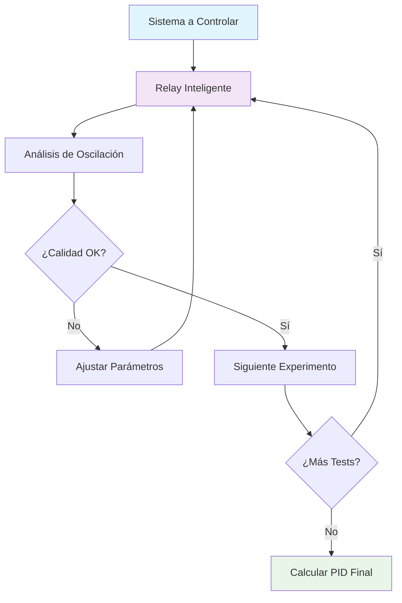

---

## Arquitectura del Algoritmo

### 🏗️ Estructura General

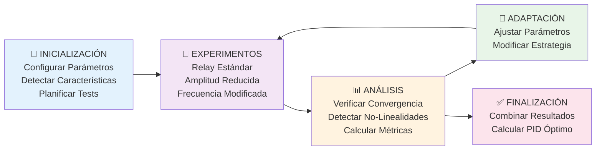

---

## Procedimiento Paso a Paso

### 🔄 Fase 1: Inicialización Inteligente

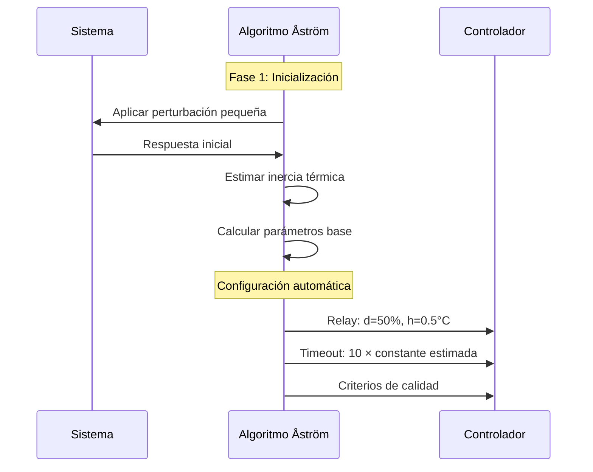

#### 📋 Pasos Detallados:

1. **🎯 Análisis Preliminar**
   ```c
   // Estimación inicial de características
   float thermal_inertia = estimate_thermal_response();
   float noise_level = measure_noise_level();
   float nonlinearity_hint = detect_initial_nonlinearity();
   ```

2. **⚙️ Configuración Adaptativa**
   ```c
   AutotuneConfig config = {
       .relay_magnitude = calculate_optimal_relay(thermal_inertia),
       .hysteresis = calculate_hysteresis(noise_level),
       .timeout_factor = calculate_timeout(thermal_inertia),
       .quality_threshold = 0.85f  // Muy exigente
   };
   ```

3. **📊 Planificación de Experimentos**
   ```c
   ExperimentPlan plan[] = {
       {STANDARD_RELAY, 1.0f, 0.5f},      // Test base
       {REDUCED_AMPLITUDE, 0.7f, 0.5f},   // Menor amplitud
       {MODIFIED_FREQUENCY, 1.0f, 0.3f},  // Frecuencia diferente
       {VALIDATION_TEST, 1.0f, 0.5f}      // Validación final
   };
   ```

### 🔄 Fase 2: Experimento Base

### 🔄 Fase 1: Inicialización Inteligente


#### 📋 Pasos Detallados:

1. **🎯 Análisis Preliminar**
   ```c
   // Estimación inicial de características
   float thermal_inertia = estimate_thermal_response();
   float noise_level = measure_noise_level();
   float nonlinearity_hint = detect_initial_nonlinearity();
   ```

2. **⚙️ Configuración Adaptativa**
   ```c
   AutotuneConfig config = {
       .relay_magnitude = calculate_optimal_relay(thermal_inertia),
       .hysteresis = calculate_hysteresis(noise_level),
       .timeout_factor = calculate_timeout(thermal_inertia),
       .quality_threshold = 0.85f  // Muy exigente
   };
   ```

3. **📊 Planificación de Experimentos**
   ```c
   ExperimentPlan plan[] = {
       {STANDARD_RELAY, 1.0f, 0.5f},      // Test base
       {REDUCED_AMPLITUDE, 0.7f, 0.5f},   // Menor amplitud
       {MODIFIED_FREQUENCY, 1.0f, 0.3f},  // Frecuencia diferente
       {VALIDATION_TEST, 1.0f, 0.5f}      // Validación final
   };
   ```

### 🔄 Fase 2: Experimento Base

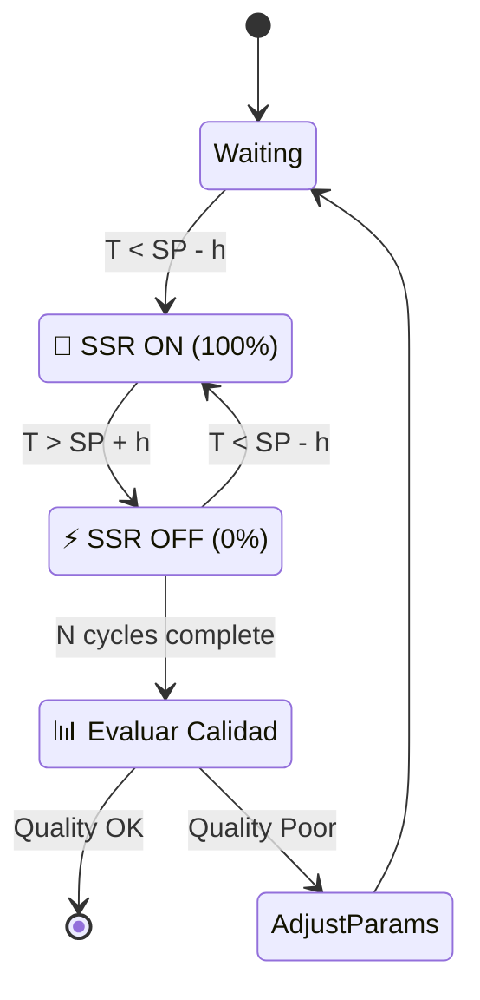

#### 📏 Mediciones Críticas:

```c
typedef struct {
    float period_avg;           // Período promedio
    float period_variance;      // Varianza del período
    float amplitude_avg;        // Amplitud promedio
    float amplitude_variance;   // Varianza de amplitud
    float asymmetry_factor;     // Factor de asimetría
    float convergence_rate;     // Velocidad de convergencia
    float noise_ratio;          // Relación señal/ruido
} OscillationMetrics;
```

### 🔄 Fase 3: Análisis de Calidad

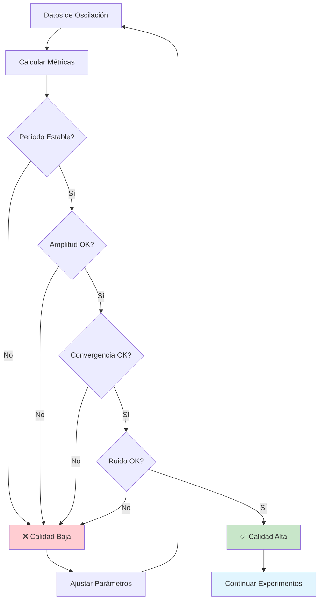

#### 🎯 Criterios de Calidad:

| Métrica | Rango Aceptable | Fórmula |
|---------|----------------|---------|
| **Estabilidad Período** | CV < 5% | `σ_periodo / μ_periodo < 0.05` |
| **Consistencia Amplitud** | CV < 10% | `σ_amplitud / μ_amplitud < 0.10` |
| **Convergencia** | > 90% | `últimos_3_ciclos / primeros_3_ciclos > 0.9` |
| **Relación S/N** | > 20 dB | `20 × log10(señal / ruido) > 20` |

### 🔄 Fase 4: Experimentos Múltiples

```mermaid
gantt
    title Secuencia de Experimentos Åström-Hägglund
    dateFormat X
    axisFormat %s
    
    section Experimento 1
    Relay Estándar     :active, exp1, 0, 300
    Análisis Calidad   :        ana1, after exp1, 60
    
    section Experimento 2
    Amplitud Reducida  :        exp2, after ana1, 280
    Análisis Calidad   :        ana2, after exp2, 60
    
    section Experimento 3
    Frecuencia Mod.    :        exp3, after ana2, 250
    Análisis Calidad   :        ana3, after exp3, 60
    
    section Validación
    Test Cruzado       :        val1, after ana3, 200
    Cálculo Final      :crit,   calc, after val1, 120
```

#### 🧪 Tipos de Experimentos:

1. **📊 Experimento Base (Estándar)**
   ```c
   RelayConfig standard = {
       .magnitude_high = 100.0f,    // Potencia máxima
       .magnitude_low = 0.0f,       // Potencia mínima  
       .hysteresis = 0.5f,          // Histéresis nominal
       .min_cycles = 5              // Ciclos mínimos
   };
   ```

2. **🔽 Amplitud Reducida**
   ```c
   RelayConfig reduced = {
       .magnitude_high = 70.0f,     // Amplitud menor
       .magnitude_low = 0.0f,       
       .hysteresis = 0.5f,          
       .min_cycles = 6              // Más ciclos para compensar
   };
   ```

3. **⚡ Frecuencia Modificada**
   ```c
   RelayConfig freq_mod = {
       .magnitude_high = 100.0f,    
       .magnitude_low = 0.0f,       
       .hysteresis = 0.3f,          // Histéresis menor = mayor frecuencia
       .min_cycles = 7              
   };
   ```

4. **🔄 Test de Validación**
   ```c
   RelayConfig validation = {
       .magnitude_high = 85.0f,     // Parámetros intermedios
       .magnitude_low = 0.0f,       
       .hysteresis = 0.4f,          
       .min_cycles = 4              // Validación rápida
   };
   ```

---

## Análisis de Calidad

### 📊 Métricas Avanzadas

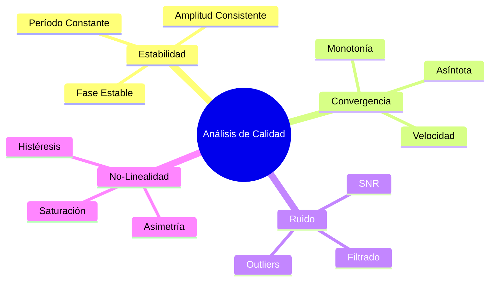

#### 🧮 Algoritmos de Evaluación:

```c
float evaluate_period_stability(float periods[], int count) {
    float mean = calculate_mean(periods, count);
    float variance = calculate_variance(periods, count, mean);
    float cv = sqrt(variance) / mean;  // Coeficiente de variación
    
    return (cv < 0.05f) ? 1.0f : (0.05f / cv);  // Score 0-1
}

float evaluate_convergence(float amplitudes[], int count) {
    // Dividir en primera y segunda mitad
    float early_mean = calculate_mean(amplitudes, count/2);
    float late_mean = calculate_mean(&amplitudes[count/2], count/2);
    
    float convergence_ratio = late_mean / early_mean;
    return (convergence_ratio > 0.9f && convergence_ratio < 1.1f) ? 1.0f : 0.0f;
}

float detect_nonlinearity(float periods[], float amplitudes[], int count) {
    // Buscar correlación período-amplitud (indica no-linealidad)
    float correlation = calculate_correlation(periods, amplitudes, count);
    return fabs(correlation);  // >0.3 indica no-linealidad significativa
}
```

### ⚠️ Criterios de Rechazo:

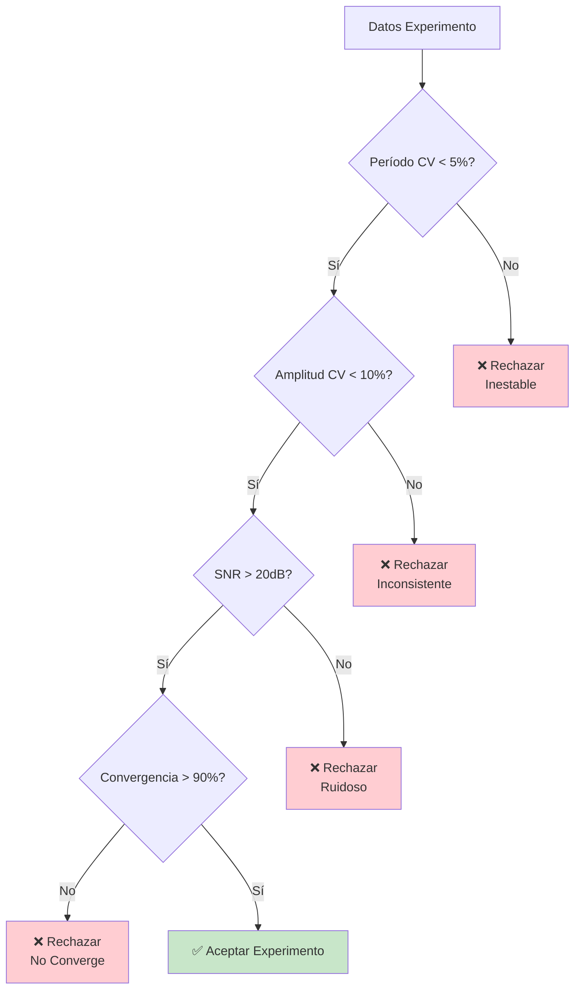

---

## Experimentos Múltiples

### 🎯 Estrategia de Experimentación

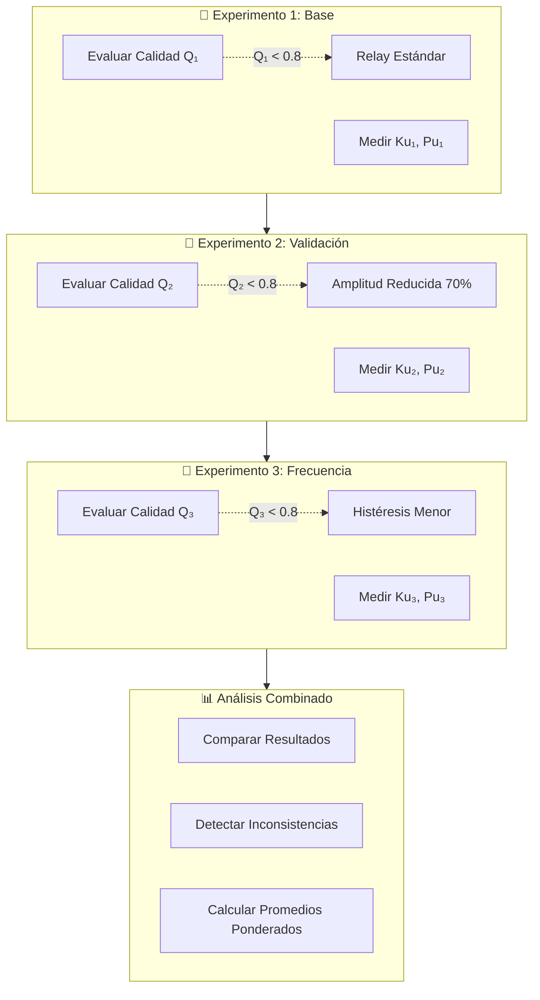

### 🧮 Combinación de Resultados

#### Promedio Ponderado por Calidad:

```c
typedef struct {
    float ku, pu;              // Parámetros medidos
    float quality_score;       // Score de calidad 0-1
    float weight;             // Peso en promedio final
} ExperimentResult;

ExperimentResult combine_results(ExperimentResult results[], int count) {
    float total_weight = 0.0f;
    float weighted_ku = 0.0f;
    float weighted_pu = 0.0f;
    
    // Calcular pesos basados en calidad
    for (int i = 0; i < count; i++) {
        results[i].weight = pow(results[i].quality_score, 2);  // Cuadrático
        total_weight += results[i].weight;
    }
    
    // Promedio ponderado
    for (int i = 0; i < count; i++) {
        float normalized_weight = results[i].weight / total_weight;
        weighted_ku += results[i].ku * normalized_weight;
        weighted_pu += results[i].pu * normalized_weight;
    }
    
    return (ExperimentResult){
        .ku = weighted_ku,
        .pu = weighted_pu,
        .quality_score = total_weight / count,  // Calidad promedio
        .weight = 1.0f
    };
}
```

---

## Detección de No-Linealidades

### 🔍 Algoritmos de Detección

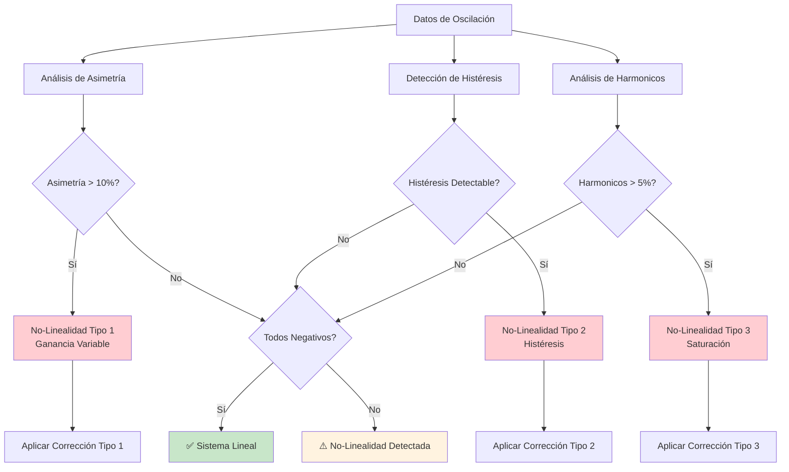

### 🎯 Tipos de No-Linealidades

#### 1. **Ganancia Variable**
```c
float detect_gain_variation(float periods[], float amplitudes[], int count) {
    // Correlación período vs amplitud
    float correlation = calculate_correlation(periods, amplitudes, count);
    
    if (fabs(correlation) > 0.3f) {
        // Ganancia cambia con amplitud de oscilación
        return correlation;
    }
    return 0.0f;  // Sistema lineal
}
```

#### 2. **Histéresis del Proceso**
```c
float detect_process_hysteresis(float temperature[], float heating[], int count) {
    float up_gain = 0.0f, down_gain = 0.0f;
    int up_count = 0, down_count = 0;
    
    for (int i = 1; i < count; i++) {
        if (heating[i] > heating[i-1]) {  // Calentando
            up_gain += (temperature[i] - temperature[i-1]);
            up_count++;
        } else {  // Enfriando
            down_gain += (temperature[i] - temperature[i-1]);
            down_count++;
        }
    }
    
    float asymmetry = fabs(up_gain/up_count - down_gain/down_count);
    return asymmetry > 0.5f ? asymmetry : 0.0f;
}
```

#### 3. **Saturación del Actuador**
```c
bool detect_actuator_saturation(float control_signal[], int count) {
    int saturated_count = 0;
    
    for (int i = 0; i < count; i++) {
        if (control_signal[i] >= 99.0f || control_signal[i] <= 1.0f) {
            saturated_count++;
        }
    }
    
    return (saturated_count > count * 0.1f);  // >10% saturación
}
```

---

## Validación y Correcciones

### ✅ Proceso de Validación Cruzada

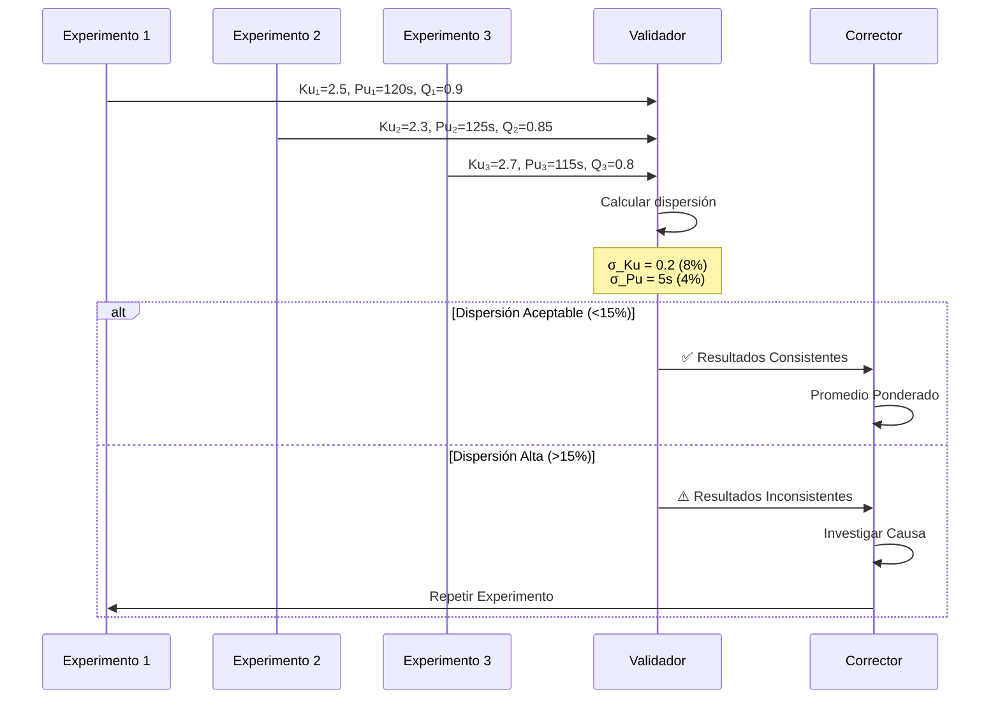

### 🔧 Algoritmos de Corrección

#### **Corrección por No-Linealidad:**

```c
PIDParams apply_nonlinearity_correction(PIDParams base_params, 
                                      NonlinearityType type, 
                                      float severity) {
    PIDParams corrected = base_params;
    
    switch (type) {
        case GAIN_VARIATION:
            // Reducir ganancia proporcional
            corrected.kp *= (1.0f - 0.2f * severity);
            // Aumentar acción integral para compensar
            corrected.ki *= (1.0f + 0.1f * severity);
            break;
            
        case PROCESS_HYSTERESIS:
            // Aumentar banda muerta efectiva
            corrected.kd *= (1.0f + 0.3f * severity);
            // Reducir integral para evitar wind-up
            corrected.ki *= (1.0f - 0.15f * severity);
            break;
            
        case ACTUATOR_SATURATION:
            // Reducir agresividad general
            corrected.kp *= 0.8f;
            corrected.ki *= 0.9f;
            corrected.kd *= 0.85f;
            break;
    }
    
    return corrected;
}
```

#### **Validación de Robustez:**

```c
bool validate_robustness(PIDParams params, SystemModel model) {
    // Test de margen de ganancia
    float gain_margin = calculate_gain_margin(params, model);
    if (gain_margin < 6.0f) return false;  // <6dB es peligroso
    
    // Test de margen de fase  
    float phase_margin = calculate_phase_margin(params, model);
    if (phase_margin < 45.0f) return false;  // <45° es peligroso
    
    // Test de estabilidad robusta
    float stability_radius = calculate_stability_radius(params, model);
    if (stability_radius < 0.3f) return false;  // Radio mínimo
    
    return true;  // Todos los tests pasados
}
```

---

## Implementación Práctica

### 🔧 Estructura de Código

```c
typedef struct {
    // Configuración
    AutotuneConfig config;
    ExperimentPlan experiments[MAX_EXPERIMENTS];
    int experiment_count;
    
    // Estado actual
    int current_experiment;
    bool experiment_active;
    uint32_t start_time;
    
    // Resultados
    ExperimentResult results[MAX_EXPERIMENTS];
    int completed_experiments;
    
    // Métricas de calidad
    QualityMetrics current_metrics;
    float overall_quality;
    
    // Detección de no-linealidades
    NonlinearityFlags detected_nonlinearities;
    float correction_factors[3];
    
} AstromAutotuner;
```

### 🚀 Función Principal

```c
AutotuneResult astrom_hagglund_autotune(float setpoint, 
                                       SystemCharacteristics hints) {
    AstromAutotuner tuner = {0};
    
    // Fase 1: Inicialización inteligente
    initialize_tuner(&tuner, setpoint, hints);
    plan_experiments(&tuner);
    
    // Fase 2: Ejecutar experimentos
    for (int i = 0; i < tuner.experiment_count; i++) {
        ExperimentResult result = execute_experiment(&tuner, i);
        
        if (result.quality_score > QUALITY_THRESHOLD) {
            tuner.results[tuner.completed_experiments++] = result;
        } else {
            // Reajustar y repetir
            adjust_experiment_parameters(&tuner, i);
            i--; // Repetir experimento
        }
    }
    
    // Fase 3: Análisis y combinación
    detect_nonlinearities(&tuner);
    ExperimentResult combined = combine_results(
        tuner.results, tuner.completed_experiments);
    
    // Fase 4: Calcular PID final
    PIDParams pid = calculate_astrom_pid(combined);
    
    // Fase 5: Aplicar correcciones
    if (tuner.detected_nonlinearities.any) {
        pid = apply_corrections(pid, tuner.detected_nonlinearities);
    }
    
    // Fase 6: Validación final
    if (!validate_pid_stability(pid)) {
        pid = apply_conservative_fallback(pid);
    }
    
    return create_autotune_result(pid, tuner.overall_quality);
}
```

### 📊 Monitoreo en Tiempo Real

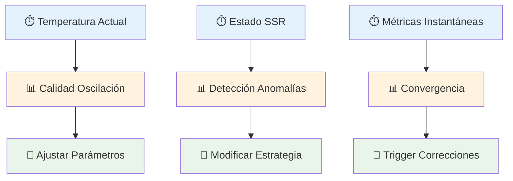

---

## Ventajas vs Métodos Clásicos

### 📊 Comparación Detallada

| Aspecto | Ziegler-Nichols | Tyreus-Luyben | **Åström-Hägglund** |
|---------|-----------------|---------------|---------------------|
| **Número de Experimentos** | 1 | 1 | **3-5** |
| **Validación Automática** | ❌ | ❌ | **✅** |
| **Detección No-Linealidad** | ❌ | ❌ | **✅** |
| **Adaptación Inteligente** | ❌ | ❌ | **✅** |
| **Robustez ante Ruido** | ⭐⭐ | ⭐⭐⭐ | **⭐⭐⭐⭐⭐** |
| **Precisión Final** | ⭐⭐⭐ | ⭐⭐⭐⭐ | **⭐⭐⭐⭐⭐** |
| **Tiempo de Ejecución** | 10-15 min | 10-15 min | **30-45 min** |
| **Complejidad Implementación** | ⭐ | ⭐ | **⭐⭐⭐⭐⭐** |

### 🎯 Casos de Uso Ideales

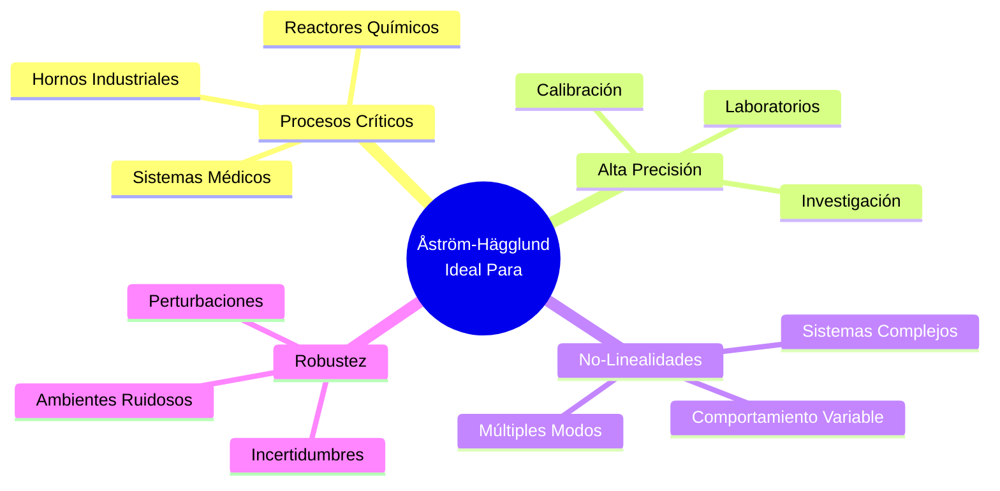

### ⚖️ Decisión de Implementación

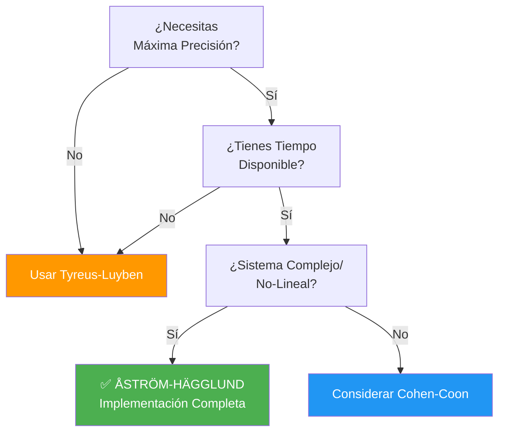

---

## 🎯 Conclusión para TriptaLabs

### **¿Cuándo Implementar Åström-Hägglund?**

#### ✅ **Ventajas para Horno de Vacío:**
- **🎯 Máxima precisión** para proceso térmico complejo
- **🔍 Detección automática** de no-linealidades por vacío
- **🛡️ Robustez excepcional** ante perturbaciones
- **📊 Validación automática** de resultados
- **⚡ Adaptación** a características variables del horno

#### ⚠️ **Consideraciones:**
- **⏱️ Tiempo:** 3-4x más lento que métodos simples
- **🧮 Complejidad:** Algoritmo muy complejo de implementar
- **💾 Recursos:** Requiere más memoria y CPU
- **🔧 Desarrollo:** 6-12 meses de desarrollo

#### 🎯 **Recomendación:**
```
📋 ROADMAP SUGERIDO:
Fase 1: Implementar Tyreus-Luyben (inmediato)
Fase 2: Desarrollar Cohen-Coon (3-6 meses)  
Fase 3: Åström-Hägglund premium (12+ meses)
```

**💡 Perfecto para versiones futuras premium del controlador donde la máxima precisión y adaptabilidad justifican la complejidad adicional.**

---

*Documentación técnica especializada - TriptaLabs Heat Controller*  
*Método Åström-Hägglund - Autotuning de próxima generación* 