# 🎯 Documentación del Sistema de Autotuning PID

**TriptaLabs Heat Controller - Issue #41**  
*Análisis completo del proceso de autotuning basado en método Ziegler-Nichols*

---

## 📋 Tabla de Contenidos

- [🎯 Documentación del Sistema de Autotuning PID](#-documentación-del-sistema-de-autotuning-pid)
  - [📋 Tabla de Contenidos](#-tabla-de-contenidos)
  - [🔍 Estado Actual](#-estado-actual)
  - [📊 Diagrama del Proceso](#-diagrama-del-proceso)
  - [⚙️ Configuración Actual](#️-configuración-actual)
  - [🔬 Análisis Técnico del Código](#-análisis-técnico-del-código)
    - [📍 Ubicación en el Código](#-ubicación-en-el-código)
    - [🧮 Algoritmo Implementado](#-algoritmo-implementado)
    - [🔄 Secuencia de Ejecución](#-secuencia-de-ejecución)
  - [📐 Método Ziegler-Nichols (Relay Feedback)](#-método-ziegler-nichols-relay-feedback)
    - [🎯 Principio Fundamental](#-principio-fundamental)
    - [📊 Fórmulas Implementadas](#-fórmulas-implementadas)
    - [⚡ Control del SSR](#-control-del-ssr)
  - [📈 Variables y Parámetros](#-variables-y-parámetros)
    - [🎛️ Parámetros de Configuración](#️-parámetros-de-configuración)
    - [📊 Variables de Estado](#-variables-de-estado)
    - [🧮 Variables de Cálculo](#-variables-de-cálculo)
  - [🔧 Implementación Detallada](#-implementación-detallada)
    - [🚀 Inicialización](#-inicialización)
    - [🔁 Ciclo Principal](#-ciclo-principal)
    - [📏 Medición de Períodos](#-medición-de-períodos)
    - [🧮 Cálculos Finales](#-cálculos-finales)
  - [🎮 Control Hardware](#-control-hardware)
  - [⚠️ Limitaciones Identificadas](#️-limitaciones-identificadas)
  - [💡 Observaciones y Recomendaciones](#-observaciones-y-recomendaciones)

---

## 🔍 Estado Actual

**📍 Ubicación:** `main/core/pid_controller.c` - Líneas 275-342  
**🚫 Estado:** Funcional pero **DESHABILITADO**  
**🔧 Motivo:** Comentado con `#if 0` para evitar warnings de función no utilizada  
**📋 API:** No existe interfaz pública para activar autotuning  

```c
#if 0  // Función no utilizada - comentada para evitar warnings
static void autotune_task(void *pvParameters) {
    // Implementación completa del autotuning...
}
#endif
```

---

## 📊 Diagrama del Proceso

```mermaid
---
config:
  theme: neo-dark
  layout: elk
  flowchart:
    curve: linear
    nodeSpacing: 50
    rankSpacing: 60
    padding: 15
    htmlLabels: false
    useMaxWidth: false
    diagramPadding: 15
---

flowchart TD

%% =====================
%% 🎯 PROCESO DE AUTOTUNING PID
%% TriptaLabs Heat Controller
%% =====================

%% Definición de subgrafos principales
subgraph INIT["🔧 INICIALIZACIÓN"]
    A1["📤 Desactivar PID Normal<br/>pid.enabled = false"]
    A2["📋 Cargar Parámetros Config<br/>• hysteresis = 0.5°C<br/>• relay_high = 100.0%<br/>• relay_low = 0.0%<br/>• min_cycles = 5<br/>• delay_ms = 100ms"]
    A3["🎯 Setpoint Fijo<br/>setpoint = 50.0°C"]
    A4["🔄 Inicializar Variables<br/>• cycleCount = 0<br/>• periodSum = 0.0<br/>• tempMax = -1000.0<br/>• tempMin = 1000.0<br/>• relayState = false"]
end

subgraph CYCLE["🔁 CICLO DE OSCILACIÓN (RELAY FEEDBACK)"]
    B1["📊 Leer Temperatura<br/>currentTemp = read_ema_temp()"]
    B2["📈 Actualizar Extremos<br/>if (currentTemp > tempMax) tempMax = currentTemp<br/>if (currentTemp < tempMin) tempMin = currentTemp"]
    B3{"🌡️ Comparar Temperatura<br/>vs Setpoint + Histéresis"}
    B4["🔌 ENCENDER SSR<br/>relayState = true<br/>CH422G_od_output(0x00)"]
    B5["⚡ APAGAR SSR<br/>relayState = false<br/>CH422G_od_output(0x02)"]
    B6["⏱️ Medir Período<br/>period = (now - lastOnTick) / 1000.0<br/>periodSum += period<br/>cycleCount++"]
    B7["⏳ Delay de Ciclo<br/>vTaskDelay(100ms)"]
    B8{"📊 ¿Ciclos Completos?<br/>cycleCount >= 5"}
end

subgraph CALC["🧮 CÁLCULO ZIEGLER-NICHOLS"]
    C1["📏 Período Promedio<br/>Pu = periodSum / cycleCount"]
    C2["📊 Amplitud de Oscilación<br/>amplitude = (tempMax - tempMin) / 2.0"]
    C3["🔄 Ganancia Crítica<br/>d = (relay_high - relay_low) / 2.0<br/>Ku = (4.0 * d) / (π * amplitude)"]
    C4["⚙️ Parámetros PID Finales<br/>Kp = 0.6 * Ku<br/>Ki = 1.2 * Ku / Pu<br/>Kd = 0.075 * Ku * Pu"]
end

subgraph FINISH["✅ FINALIZACIÓN"]
    D1["💾 Guardar Parámetros<br/>pid_set_params(new_kp, new_ki, new_kd)"]
    D2["📋 Mostrar Resultados<br/>printf('Kp=%.4f, Ki=%.4f, Kd=%.4f')"]
    D3["🗑️ Eliminar Tarea<br/>vTaskDelete(NULL)"]
end

%% =====================
%% CONEXIONES PRINCIPALES
%% =====================

%% Secuencia principal
A1 --> A2 --> A3 --> A4 --> B1

%% Ciclo de control
B1 --> B2 --> B3
B3 --> B4
B3 --> B5
B4 --> B6
B6 --> B7
B5 --> B7
B7 --> B8
B8 -->|No| B1
B8 -->|Sí| C1

%% Cálculos
C1 --> C2 --> C3 --> C4

%% Finalización
C4 --> D1 --> D2 --> D3

%% =====================
%% ESTILOS Y COLORES
%% =====================

%% Inicialización - Azul
style A1 fill:#4FC3F7,stroke:#0277BD,color:#000000
style A2 fill:#4FC3F7,stroke:#0277BD,color:#000000
style A3 fill:#4FC3F7,stroke:#0277BD,color:#000000
style A4 fill:#4FC3F7,stroke:#0277BD,color:#000000

%% Ciclo - Verde
style B1 fill:#66BB6A,stroke:#388E3C,color:#000000
style B2 fill:#66BB6A,stroke:#388E3C,color:#000000
style B3 fill:#FFB74D,stroke:#F57C00,color:#000000
style B4 fill:#FF8A65,stroke:#D84315,color:#000000
style B5 fill:#9575CD,stroke:#512DA8,color:#000000
style B6 fill:#66BB6A,stroke:#388E3C,color:#000000
style B7 fill:#66BB6A,stroke:#388E3C,color:#000000
style B8 fill:#FFB74D,stroke:#F57C00,color:#000000

%% Cálculos - Naranja
style C1 fill:#FFB74D,stroke:#F57C00,color:#000000
style C2 fill:#FFB74D,stroke:#F57C00,color:#000000
style C3 fill:#FFB74D,stroke:#F57C00,color:#000000
style C4 fill:#FFB74D,stroke:#F57C00,color:#000000

%% Finalización - Verde oscuro
style D1 fill:#4CAF50,stroke:#2E7D32,color:#000000
style D2 fill:#4CAF50,stroke:#2E7D32,color:#000000
style D3 fill:#4CAF50,stroke:#2E7D32,color:#000000
```



---

## ⚙️ Configuración Actual

El sistema tiene una configuración **predefinida y optimizada** para el horno de vacío:

```c
// Referencia: main/core/pid_controller.c - Líneas 79-83
static const PIDConfig_t pid_config = {
    .autotune_hysteresis = 0.5f,    // Histéresis para autotuning (0.5°C)
    .autotune_relay_high = 100.0f,  // Valor alto del relé (100%)
    .autotune_relay_low = 0.0f,     // Valor bajo del relé (0%)
    .autotune_min_cycles = 5,       // Mínimo de ciclos para autotuning
    .autotune_delay_ms = 100,       // Retardo entre ciclos (100ms)
    // ... otros parámetros
};
```

| Parámetro | Valor | Descripción |
|-----------|-------|-------------|
| `autotune_hysteresis` | **0.5°C** | Banda de histéresis para evitar oscilaciones menores |
| `autotune_relay_high` | **100.0%** | Potencia máxima del SSR durante la fase ON |
| `autotune_relay_low` | **0.0%** | Potencia mínima del SSR durante la fase OFF |
| `autotune_min_cycles` | **5 ciclos** | Número mínimo de oscilaciones para obtener datos válidos |
| `autotune_delay_ms` | **100ms** | Intervalo entre lecturas de temperatura |

---

## 🔬 Análisis Técnico del Código

### 📍 Ubicación en el Código

```c
// main/core/pid_controller.c - Líneas 275-342
#if 0  // Función no utilizada - comentada para evitar warnings
static void autotune_task(void *pvParameters) {
    // Implementación completa...
}
#endif
```

### 🧮 Algoritmo Implementado

**🎯 Método:** Ziegler-Nichols con Relay Feedback  
**📊 Técnica:** Oscilación controlada del sistema  
**🎛️ Control:** On/Off con histéresis  

### 🔄 Secuencia de Ejecución

1. **🚀 Inicialización** → Desactivar PID normal y configurar variables
2. **🔁 Ciclo de Oscilación** → Generar oscillaciones controladas 
3. **📏 Medición** → Capturar períodos y amplitudes
4. **🧮 Cálculo** → Aplicar fórmulas Ziegler-Nichols
5. **💾 Finalización** → Guardar parámetros optimizados

---

## 📐 Método Ziegler-Nichols (Relay Feedback)

### 🎯 Principio Fundamental

El autotuning implementado utiliza el **método de relay feedback** para determinar las características críticas del sistema:

- **Ku** (Ganancia crítica): Ganancia que produce oscilaciones sostenidas
- **Pu** (Período crítico): Período de las oscilaciones sostenidas

### 📊 Fórmulas Implementadas

```c
// Referencia: main/core/pid_controller.c - Líneas 329-335
float Pu = periodSum / cycleCount;                    // Período promedio
float amplitude = (tempMax - tempMin) / 2.0f;        // Amplitud de oscilación
float d = (relay_high - relay_low) / 2.0f;           // Magnitud del relay
float Ku = (4.0f * d) / (M_PI * amplitude);          // Ganancia crítica

// Parámetros PID según Ziegler-Nichols
float new_kp = 0.6f * Ku;                            // Kp = 0.6 * Ku
float new_ki = 1.2f * Ku / Pu;                       // Ki = 1.2 * Ku / Pu  
float new_kd = 0.075f * Ku * Pu;                     // Kd = 0.075 * Ku * Pu
```

**🔗 Relaciones matemáticas:**
- **Ku = (4 × d) / (π × amplitud)**
- **d = (relay_high - relay_low) / 2**
- **Pu = período_promedio**

### ⚡ Control del SSR

El sistema controla el SSR (Solid State Relay) a través del chip CH422G:

```c
// Encender SSR (aplicar calor)
CH422G_EnsurePushPullMode();
CH422G_od_output(0x00);  // Output LOW = SSR ON

// Apagar SSR (sin calor)  
CH422G_EnsurePushPullMode();
CH422G_od_output(0x02);  // Output HIGH = SSR OFF
```

---

## 📈 Variables y Parámetros

### 🎛️ Parámetros de Configuración

| Variable | Tipo | Valor | Función |
|----------|------|-------|---------|
| `hysteresis` | `float` | `0.5f` | Banda de tolerancia para cambios de estado |
| `relay_high` | `float` | `100.0f` | Porcentaje de potencia en estado ON |
| `relay_low` | `float` | `0.0f` | Porcentaje de potencia en estado OFF |
| `minCycles` | `uint8_t` | `5` | Ciclos mínimos para validar medición |
| `setpoint` | `float` | `50.0f` | **Temperatura objetivo fija (hardcoded)** |

### 📊 Variables de Estado

| Variable | Tipo | Inicial | Función |
|----------|------|---------|---------|
| `cycleCount` | `uint8_t` | `0` | Contador de ciclos completados |
| `periodSum` | `float` | `0.0f` | Suma acumulada de períodos |
| `tempMax` | `float` | `-1000.0f` | Temperatura máxima registrada |
| `tempMin` | `float` | `1000.0f` | Temperatura mínima registrada |
| `relayState` | `bool` | `false` | Estado actual del relay (ON/OFF) |
| `lastOnTick` | `TickType_t` | `0` | Timestamp del último encendido |

### 🧮 Variables de Cálculo

| Variable | Función | Fórmula |
|----------|---------|---------|
| `Pu` | Período crítico | `periodSum / cycleCount` |
| `amplitude` | Amplitud de oscilación | `(tempMax - tempMin) / 2.0` |
| `d` | Magnitud del relay | `(relay_high - relay_low) / 2.0` |
| `Ku` | Ganancia crítica | `(4.0 * d) / (π * amplitude)` |

---

## 🔧 Implementación Detallada

### 🚀 Inicialización

```c
// Referencia: main/core/pid_controller.c - Líneas 277-295
pid.enabled = false;  // Desactivar PID normal

// Cargar configuración
const float hysteresis = pid_config.autotune_hysteresis;     // 0.5°C
const float relay_high = pid_config.autotune_relay_high;     // 100.0%
const float relay_low = pid_config.autotune_relay_low;       // 0.0%
const float d = (relay_high - relay_low) / 2.0f;            // 50.0

// Setpoint fijo para autotuning
float setpoint = 50.0f;  // ⚠️ HARDCODED

// Inicializar contadores y variables de medición
uint8_t cycleCount = 0;
float periodSum = 0.0f;
TickType_t lastOnTick = 0;
float tempMax = -1000.0f;
float tempMin = 1000.0f;
bool relayState = false;
```

### 🔁 Ciclo Principal

```c
// Referencia: main/core/pid_controller.c - Líneas 296-325
while (cycleCount < minCycles) {
    // 1. Leer temperatura filtrada EMA
    float currentTemp = read_ema_temp();
    
    // 2. Actualizar extremos para calcular amplitud
    if (currentTemp > tempMax) tempMax = currentTemp;
    if (currentTemp < tempMin) tempMin = currentTemp;
    
    // 3. Lógica de control con histéresis
    if (!relayState && (currentTemp < setpoint - hysteresis)) {
        // Encender SSR: Temperatura bajo setpoint - histéresis
        relayState = true;
        CH422G_od_output(0x00);
        // Medir período...
    } else if (relayState && (currentTemp > setpoint + hysteresis)) {
        // Apagar SSR: Temperatura sobre setpoint + histéresis  
        relayState = false;
        CH422G_od_output(0x02);
    }
    
    // 4. Delay entre mediciones
    vTaskDelay(pdMS_TO_TICKS(autotune_delay_ms));  // 100ms
}
```

### 📏 Medición de Períodos

```c
// Referencia: main/core/pid_controller.c - Líneas 310-317
TickType_t now = xTaskGetTickCount();
if (lastOnTick != 0) {
    float period = (now - lastOnTick) / 1000.0f;  // Convertir a segundos
    periodSum += period;                          // Acumular para promedio
    cycleCount++;                                // Incrementar contador
    printf("[Autotune] 🔁 Periodo #%d: %.2fs\n", cycleCount, period);
}
lastOnTick = now;  // Actualizar timestamp
```

### 🧮 Cálculos Finales

```c
// Referencia: main/core/pid_controller.c - Líneas 329-340
// Apagar SSR al finalizar
CH422G_od_output(0x02);

// Calcular parámetros críticos
float Pu = periodSum / cycleCount;                // Período crítico
float amplitude = (tempMax - tempMin) / 2.0f;    // Amplitud
float Ku = (4.0f * d) / (M_PI * amplitude);      // Ganancia crítica

// Aplicar fórmulas Ziegler-Nichols
float new_kp = 0.6f * Ku;           // Proporcional
float new_ki = 1.2f * Ku / Pu;      // Integral  
float new_kd = 0.075f * Ku * Pu;    // Derivativo

// Mostrar y guardar resultados
printf("[Autotune] ✅ Finalizado\n");
printf("Kp = %.4f, Ki = %.4f, Kd = %.4f\n", new_kp, new_ki, new_kd);
pid_set_params(new_kp, new_ki, new_kd);  // Guardar en NVS

// Eliminar tarea
vTaskDelete(NULL);
```

---

## 🎮 Control Hardware

**🔌 Chip de Control:** CH422G I/O Expander  
**⚡ SSR Control:** Output OC1 (Open Drain)

| Estado | Comando | Resultado |
|--------|---------|-----------|
| **🔌 SSR ON** | `CH422G_od_output(0x00)` | Aplicar calor al horno |
| **⚡ SSR OFF** | `CH422G_od_output(0x02)` | Sin calor, enfriamiento |

**🔧 Secuencia de Control:**
1. `CH422G_EnsurePushPullMode()` - Configurar modo push-pull
2. `CH422G_od_output(valor)` - Aplicar estado al SSR
3. El SSR controla la resistencia calefactora del horno

---

## ⚠️ Limitaciones Identificadas

1. **🎯 Setpoint Fijo:** Hardcoded a 50.0°C, no configurable
2. **🚫 Sin API Pública:** No hay forma de activar desde UI/código
3. **⏱️ Timing Fijo:** Delay de 100ms no optimizable dinámicamente  
4. **📊 Sin Validación:** No verifica convergencia o estabilidad
5. **🔄 Sin Reintentos:** No maneja fallos en la oscilación
6. **📋 Sin Persistencia:** No guarda configuración de autotuning
7. **🎛️ Sin Parámetros:** Valores fijos, no adaptables al proceso

---

## 💡 Observaciones y Recomendaciones

### ✅ **Fortalezas del Diseño**

- **🧮 Algoritmo Robusto:** Implementación correcta de Ziegler-Nichols
- **📊 Medición Precisa:** Uso de EMA para filtrado de temperatura
- **🔄 Control Estable:** Histéresis previene oscilaciones menores
- **💾 Persistencia:** Guarda automáticamente parámetros en NVS
- **🔧 Hardware Integrado:** Control directo del SSR vía CH422G

### 🔄 **Potenciales Mejoras**

- **🎯 Setpoint Configurable:** Permitir diferentes temperaturas de test
- **📈 Validación de Convergencia:** Verificar estabilidad de oscilaciones
- **⚠️ Timeouts de Seguridad:** Evitar procesos infinitos
- **📊 Métricas Avanzadas:** Calidad de oscilación, SNR, etc.
- **🎛️ Parámetros Adaptativos:** Ajustar según características del proceso

### 📝 **Estado para Issue #41**

**✅ Documentación Completa:** Proceso totalmente analizado y documentado  
**📋 Próximos Pasos:** Esperando feedback para ajustes específicos  
**🎯 Objetivo:** Implementar mejoras basadas en análisis del usuario  

---

*Documentación generada por análisis exhaustivo del código fuente existente*  
*TriptaLabs Heat Controller - Commit base: main branch* 