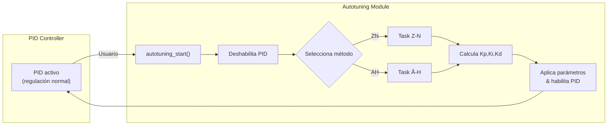

# 🎯 Documentación del Sistema de Autotuning PID

**TriptaLabs Heat Controller – Issue #43**  
*Refactorización completa y soporte de múltiples métodos de autotuning*

---

## 📋 Tabla de Contenidos

- [🔍 Visión General](#-visión-general)
- [⚙️ Arquitectura](#️-arquitectura)
- [🔧 API Pública](#-api-pública)
- [📐 Métodos de Autotuning](#-métodos-de-autotuning)
  - [Ziegler-Nichols (Relay Feedback)](#ziegler-nichols-relay-feedback)
  - [Åström-Hägglund (Relay Feedback)](#åström-hägglund-relay-feedback)
- [📈 Parámetros de Configuración](#-parámetros-de-configuración)
- [🚦 Diagrama de Flujo](#-diagrama-de-flujo)
- [⚠️ Consideraciones y Errores Comunes](#️-consideraciones-y-errores-comunes)
- [📄 Historial de Cambios](#-historial-de-cambios)

---

## 🔍 Visión General

El sistema de autotuning permite calcular automáticamente los parámetros PID \(K_p, K_i, K_d\) del horno de vacío.  
A partir de **Issue #43** se separó completamente del `pid_controller` y se implementó como un **módulo independiente** en:

```text
main/core/autotuning/
├── autotuning.c / .h         # Enrutador y API pública
├── ziegler_nichols.c / .h    # Método Z-N
└── astrom_hagglund.c / .h    # Método Å-H
```

El módulo expone una **API sencilla** que permite:

1. Inicializar el autotuning con un método y setpoint deseados.
2. Lanzar el proceso de autotuning (crea una tarea FreeRTOS dedicada).
3. Consultar los parámetros PID resultantes.
4. Cancelar un proceso en curso.

Durante la ejecución, el controlador PID **normal se desactiva** para evitar interferencias y se reactiva automáticamente al finalizar con los nuevos parámetros.

---

## ⚙️ Arquitectura



---

## 🔧 API Pública

```c
#include "autotuning.h"

// Configuración
autotune_config_t cfg = {
    .method          = AUTOTUNE_METHOD_ZN,   // o AUTOTUNE_METHOD_AH
    .setpoint        = 50.0f,               // °C deseados para el test
    .max_duration_ms = 600000               // 10 minutos de timeout
};

// Inicializar
ESP_ERROR_CHECK( autotuning_init(&cfg) );

// Iniciar proceso (crea tarea FreeRTOS)
ESP_ERROR_CHECK( autotuning_start() );

// … esperar a que termine (consultar un flag, evento o logs) …

// Obtener resultados
float kp, ki, kd;
if (autotuning_get_pid(&kp, &ki, &kd) == ESP_OK) {
    printf("Nuevos PID → Kp=%.2f Ki=%.2f Kd=%.2f\n", kp, ki, kd);
}
```

> **Nota:**  Mientras `autotuning_is_running()` devuelve `true` el PID normal está deshabilitado.

---

## 📐 Métodos de Autotuning

### Ziegler-Nichols (Relay Feedback)

* **Archivo:** `ziegler_nichols.c`  
* **Ciclos mínimos:** 5  
* **Ganancia crítica:** \(K_u = 4d / \pi a\)  
* **Aplicación de fórmulas Z-N estándar** para controlador PID:
  \(K_p = 0.6K_u\) \(K_i = 1.2K_u / P_u\) \(K_d = 0.075K_u P_u\)
* Recomendado para la mayoría de procesos térmicos.

### Åström-Hägglund (Relay Feedback)

* **Archivo:** `astrom_hagglund.c`  
* Basado en el mismo principio de oscilación que Z-N pero con distintas reglas empíricas (idénticas en esta primera versión para PID estándar).  
* Útil en procesos con gran inercia o no linealidades pronunciadas.

---

## 📈 Parámetros de Configuración

| Campo | Tipo | Descripción |
|-------|------|-------------|
| `method` | `autotune_method_t` | Método a utilizar (ZN o AH) |
| `setpoint` | `float` | Temperatura objetivo para el test (°C) |
| `max_duration_ms` | `int` | Tiempo máximo permitido antes de cancelar |

Los valores de histéresis, relé alto/bajo, ciclos mínimos y delay entre lecturas se obtienen de `pid_config` en *pid_controller.c* y son comunes a ambos métodos.

---

## 🚦 Diagrama de Flujo

El diagrama Mermaid actualizado se encuentra en `docs/autotune/autotune.mmd`.  
Se generan dos sub-grafos, uno por método, compartiendo bloques de inicio y finalización.

---

## ⚠️ Consideraciones y Errores Comunes

1. **PID activo** – El PID normal se deshabilita automáticamente; no intentes llamar a `enable_pid()` manualmente mientras corre el autotuning.
2. **Timeout** – Si el proceso supera `max_duration_ms`, se cancela y se reactiva el PID con los parámetros anteriores.
3. **Convergencia** – El sistema no valida aún estabilidad de los parámetros; verifica manualmente los resultados.
4. **Setpoint adecuado** – Elige un setpoint dentro del rango de operación normal (recomendado 40-60 °C para el horno).

---

## 📄 Historial de Cambios

| Fecha | Versión | Descripción |
|-------|---------|-------------|
| 2025-07-02 | 2.0 | Refactor completo, módulo independiente, soporte ZN + AH, nueva API pública |
| 2024-10-15 | 1.0 | Implementación inicial Ziegler-Nichols dentro de `pid_controller.c` (obsoleta) |
