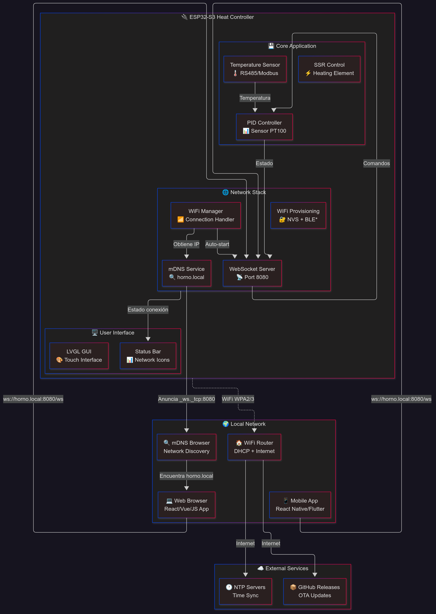
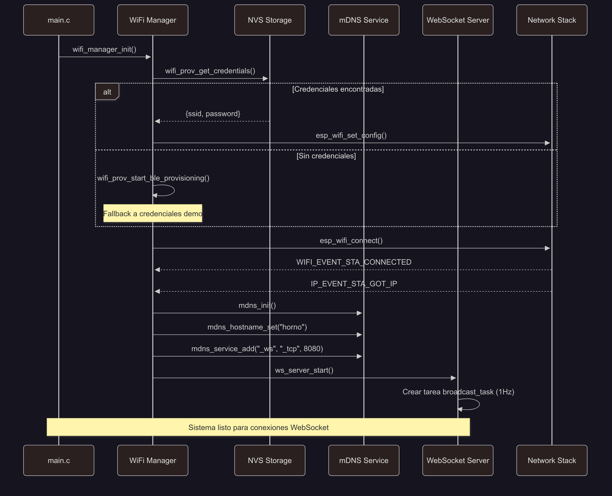
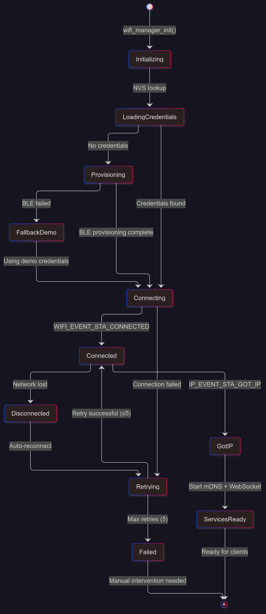
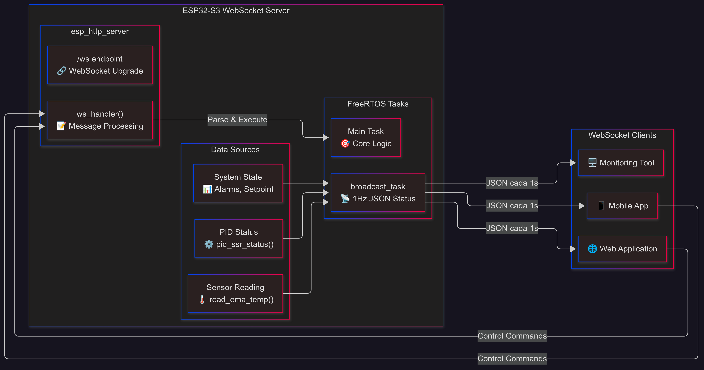
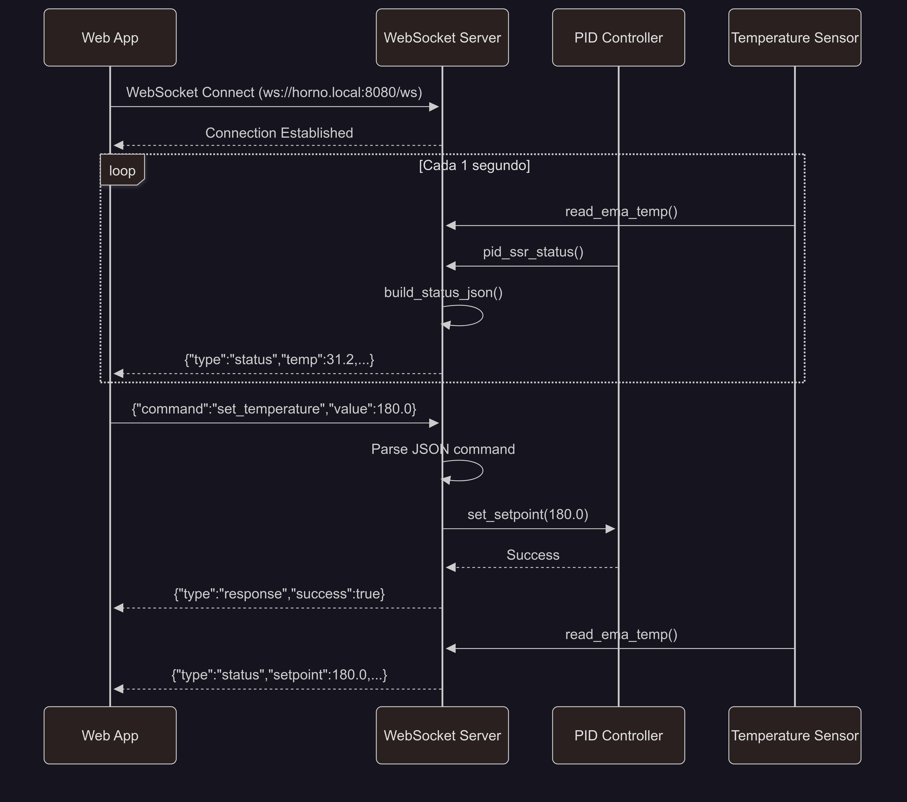

# Arquitectura de Red y WebSocket - TriptaLabs Heat Controller

## Resumen Ejecutivo

Este documento describe la **arquitectura completa de red y WebSocket** implementada en el TriptaLabs Heat Controller (ESP32-S3). El sistema proporciona conectividad WiFi robusta, descubrimiento automático vía mDNS, y un servidor WebSocket para comunicación en tiempo real con aplicaciones web.

### Características Principales
- 🌐 **WiFi Manager**: Conexión automática con reconexión inteligente
- 🔍 **mDNS Discovery**: Acceso vía `horno.local` sin conocer la IP
- 📡 **WebSocket Server**: Comunicación bidireccional en tiempo real
- 🔄 **Broadcasting**: Estado del sistema cada 1 segundo (configurable)
- 📱 **Multi-cliente**: Soporte para aplicación web y monitoreo remoto

---

## 1. Arquitectura General del Sistema

### 1.1 Diagrama de Componentes



### 1.2 Flujo de Inicialización



---

## 2. Gestión WiFi (wifi_manager.c)

### 2.1 Características

```25:53:main/core/wifi_manager.c
static void wifi_event_handler(void* arg, esp_event_base_t event_base, int32_t event_id, void* event_data)
{
    if (event_base == WIFI_EVENT && event_id == WIFI_EVENT_STA_DISCONNECTED) {
        if (s_retry_num < 5) {
            esp_wifi_connect();
            s_retry_num++;
            ESP_LOGI(TAG, "Reintentando conexión WiFi (%d)", s_retry_num);
        } else {
            xEventGroupSetBits(s_wifi_event_group, WIFI_FAIL_BIT);
        }
    } else if (event_base == IP_EVENT && event_id == IP_EVENT_STA_GOT_IP) {
        s_retry_num = 0;
        xEventGroupSetBits(s_wifi_event_group, WIFI_CONNECTED_BIT);
        // Inicializar mDNS una sola vez
        static bool mdns_started = false;
        if (!mdns_started) {
            mdns_init();
            mdns_hostname_set("horno");
            mdns_service_add(NULL, "_ws", "_tcp", WS_SERVER_PORT, NULL, 0);
            ws_server_start();
            mdns_started = true;
            ESP_LOGI(TAG, "mDNS hostname 'horno.local' registrado");
        }
    }
}
```

### 2.2 Diagrama de Estados WiFi



### 2.3 Provisioning de Credenciales

```8:44:main/core/wifi_prov.c
esp_err_t wifi_prov_get_credentials(wifi_credentials_t *cred)
{
    if (!cred) return ESP_ERR_INVALID_ARG;

    nvs_handle_t handle;
    esp_err_t err = nvs_open(NVS_NAMESPACE, NVS_READONLY, &handle);
    if (err != ESP_OK) {
        ESP_LOGW(TAG, "No se pudo abrir NVS: %s", esp_err_to_name(err));
        return err;
    }

    size_t ssid_len = sizeof(cred->ssid);
    err = nvs_get_str(handle, "ssid", cred->ssid, &ssid_len);
    if (err != ESP_OK) {
        nvs_close(handle);
        return ESP_ERR_NOT_FOUND;
    }

    size_t pass_len = sizeof(cred->password);
    err = nvs_get_str(handle, "pass", cred->password, &pass_len);
    nvs_close(handle);
    if (err != ESP_OK) {
        return ESP_ERR_NOT_FOUND;
    }

    ESP_LOGI(TAG, "Credenciales leídas: SSID=%s", cred->ssid);
    return ESP_OK;
}
```

---

## 3. Descubrimiento de Red (mDNS)

### 3.1 Configuración del Servicio

El sistema registra automáticamente:
- **Hostname**: `horno.local`
- **Servicio**: `_ws._tcp.local` en puerto 8080
- **Protocolo**: WebSocket sobre HTTP

### 3.2 Resolución desde Cliente

```javascript
// Ejemplo JavaScript para descubrimiento
const discoverWebSocketService = async () => {
    try {
        // Opción 1: Conexión directa por hostname
        const ws = new WebSocket('ws://horno.local:8080/ws');
        
        // Opción 2: Resolución manual de IP (si mDNS no funciona)
        const response = await fetch('http://horno.local:8080');
        console.log('Servidor encontrado');
    } catch (error) {
        console.error('No se pudo conectar al horno:', error);
    }
};
```

### 3.3 Configuración de Red

```11:19:main/core/network_config.h
/** Número máximo de clientes WebSocket simultáneos permitidos */
#define MAX_WS_CLIENTS 1

/** Puerto TCP en el que escucha el servidor WebSocket */
#define WS_SERVER_PORT 8080
```

---

## 4. Servidor WebSocket

### 4.1 Arquitectura del Servidor



### 4.2 Implementación del Servidor

```85:115:main/core/ws_server/ws_server.c
esp_err_t ws_server_start(void)
{
    if (s_server) return ESP_OK;

    httpd_config_t config = HTTPD_DEFAULT_CONFIG();
    config.server_port = WS_SERVER_PORT;
    config.ctrl_port = 0; // deshabilitar control socket para ahorrar

    ESP_LOGI(TAG, "Iniciando servidor WS en puerto %d", config.server_port);
    esp_err_t ret = httpd_start(&s_server, &config);
    if (ret != ESP_OK) {
        ESP_LOGE(TAG, "Error iniciando httpd: %s", esp_err_to_name(ret));
        s_server = NULL;
        return ret;
    }

    httpd_uri_t ws_uri = {
        .uri = "/ws",
        .method = HTTP_GET,
        .handler = ws_handler,
        .user_ctx = NULL,
        .is_websocket = true
    };
    httpd_register_uri_handler(s_server, &ws_uri);

    xTaskCreate(broadcast_task, "ws_broadcast", 4096, NULL, 4, &s_broadcast_task);
    return ESP_OK;
}
```

### 4.3 Broadcast de Estado (JSON)

```14:26:main/core/ws_server/ws_server.c
static char *build_status_json(void)
{
    float temp = read_ema_temp();
    cJSON *root = cJSON_CreateObject();
    cJSON_AddStringToObject(root, "type", "status");
    cJSON_AddNumberToObject(root, "temp", temp);
    cJSON_AddNumberToObject(root, "setpoint", 0.0f); // TODO: obtener setpoint real
    cJSON_AddBoolToObject(root, "pid_enabled", true); // TODO
    cJSON_AddBoolToObject(root, "ssr", pid_ssr_status());
    cJSON_AddBoolToObject(root, "alarm", false);
    char *str = cJSON_PrintUnformatted(root);
    cJSON_Delete(root);
    return str;
}
```

### 4.4 Formato de Mensaje JSON

```json
{
    "type": "status",
    "temp": 31.2,
    "setpoint": 150.0,
    "pid_enabled": true,
    "ssr": false,
    "alarm": false
}
```

---

## 5. Protocolo de Comunicación WebSocket

### 5.1 Mensajes del Servidor → Cliente

| Tipo | Frecuencia | Descripción | Ejemplo |
|------|------------|-------------|---------|
| `status` | 1 Hz | Estado del sistema | `{"type":"status","temp":31.2,"setpoint":150.0,"pid_enabled":true,"ssr":false,"alarm":false}` |
| `alert` | Evento | Alarmas del sistema | `{"type":"alert","level":"warning","message":"Temperatura alta"}` |
| `response` | Respuesta | Confirmación de comando | `{"type":"response","command":"set_temperature","success":true}` |

### 5.2 Mensajes del Cliente → Servidor

| Comando | Parámetros | Descripción | Ejemplo |
|---------|------------|-------------|---------|
| `set_temperature` | `value: number` | Cambiar setpoint | `{"command":"set_temperature","value":180.0}` |
| `enable_pid` | `enabled: boolean` | Activar/desactivar PID | `{"command":"enable_pid","enabled":true}` |
| `emergency_stop` | - | Parada de emergencia | `{"command":"emergency_stop"}` |

### 5.3 Diagrama de Secuencia




## 6. Implementación en Aplicación Web

### 6.1 Cliente JavaScript Básico

```javascript
class HornoWebSocketClient {
    constructor(hostname = 'horno.local', port = 8080) {
        this.url = `ws://${hostname}:${port}/ws`;
        this.ws = null;
        this.reconnectInterval = 5000;
        this.listeners = new Map();
    }
    
    connect() {
        try {
            this.ws = new WebSocket(this.url);
            
            this.ws.onopen = () => {
                console.log('Conectado al horno');
                this.emit('connected');
            };
            
            this.ws.onmessage = (event) => {
                const data = JSON.parse(event.data);
                this.emit('message', data);
                
                // Procesar mensajes específicos
                if (data.type === 'status') {
                    this.emit('status', data);
                }
            };
            
            this.ws.onclose = () => {
                console.log('Conexión cerrada. Reintentando...');
                setTimeout(() => this.connect(), this.reconnectInterval);
            };
            
            this.ws.onerror = (error) => {
                console.error('Error WebSocket:', error);
            };
            
        } catch (error) {
            console.error('No se pudo conectar:', error);
            setTimeout(() => this.connect(), this.reconnectInterval);
        }
    }
    
    sendCommand(command, params = {}) {
        if (this.ws && this.ws.readyState === WebSocket.OPEN) {
            const message = { command, ...params };
            this.ws.send(JSON.stringify(message));
        }
    }
    
    setTemperature(value) {
        this.sendCommand('set_temperature', { value });
    }
    
    enablePID(enabled) {
        this.sendCommand('enable_pid', { enabled });
    }
    
    emergencyStop() {
        this.sendCommand('emergency_stop');
    }
    
    on(event, callback) {
        if (!this.listeners.has(event)) {
            this.listeners.set(event, []);
        }
        this.listeners.get(event).push(callback);
    }
    
    emit(event, data) {
        const callbacks = this.listeners.get(event) || [];
        callbacks.forEach(callback => callback(data));
    }
}

// Uso del cliente
const horno = new HornoWebSocketClient();

horno.on('status', (data) => {
    document.getElementById('temperature').textContent = `${data.temp}°C`;
    document.getElementById('setpoint').textContent = `${data.setpoint}°C`;
    document.getElementById('ssr-status').textContent = data.ssr ? 'ON' : 'OFF';
});

horno.on('connected', () => {
    console.log('¡Conectado al horno!');
});

horno.connect();
```

### 6.2 Interfaz de Usuario React

```jsx
import React, { useState, useEffect } from 'react';

const HornoController = () => {
    const [status, setStatus] = useState({
        temp: 0,
        setpoint: 0,
        pid_enabled: false,
        ssr: false,
        alarm: false,
        connected: false
    });
    
    const [targetTemp, setTargetTemp] = useState(150);
    const [ws, setWs] = useState(null);
    
    useEffect(() => {
        const websocket = new WebSocket('ws://horno.local:8080/ws');
        
        websocket.onopen = () => {
            setStatus(prev => ({ ...prev, connected: true }));
        };
        
        websocket.onmessage = (event) => {
            const data = JSON.parse(event.data);
            if (data.type === 'status') {
                setStatus(prev => ({ ...prev, ...data, connected: true }));
            }
        };
        
        websocket.onclose = () => {
            setStatus(prev => ({ ...prev, connected: false }));
        };
        
        setWs(websocket);
        
        return () => websocket.close();
    }, []);
    
    const sendCommand = (command, params = {}) => {
        if (ws && ws.readyState === WebSocket.OPEN) {
            ws.send(JSON.stringify({ command, ...params }));
        }
    };
    
    const handleSetTemperature = () => {
        sendCommand('set_temperature', { value: targetTemp });
    };
    
    const togglePID = () => {
        sendCommand('enable_pid', { enabled: !status.pid_enabled });
    };
    
    const emergencyStop = () => {
        sendCommand('emergency_stop');
    };
    
    return (
        <div className="horno-controller">
            <div className={`status ${status.connected ? 'connected' : 'disconnected'}`}>
                Estado: {status.connected ? 'Conectado' : 'Desconectado'}
            </div>
            
            <div className="temperature-display">
                <h2>Temperatura Actual: {status.temp.toFixed(1)}°C</h2>
                <h3>Objetivo: {status.setpoint.toFixed(1)}°C</h3>
                <div className={`ssr-indicator ${status.ssr ? 'on' : 'off'}`}>
                    SSR: {status.ssr ? 'ENCENDIDO' : 'APAGADO'}
                </div>
            </div>
            
            <div className="controls">
                <div>
                    <label>
                        Temperatura objetivo:
                        <input
                            type="number"
                            value={targetTemp}
                            onChange={(e) => setTargetTemp(Number(e.target.value))}
                            min="0"
                            max="300"
                        />
                    </label>
                    <button onClick={handleSetTemperature}>
                        Establecer
                    </button>
                </div>
                
                <button 
                    onClick={togglePID}
                    className={status.pid_enabled ? 'enabled' : 'disabled'}
                >
                    PID: {status.pid_enabled ? 'ACTIVADO' : 'DESACTIVADO'}
                </button>
                
                <button 
                    onClick={emergencyStop}
                    className="emergency"
                >
                    PARADA DE EMERGENCIA
                </button>
            </div>
            
            {status.alarm && (
                <div className="alert">
                    ⚠️ ALARMA: Sistema en estado de alarma
                </div>
            )}
        </div>
    );
};

export default HornoController;
```

---

## 7. Configuración y Debugging

### 7.1 Configuración ESP-IDF

```1177:1181:sdkconfig
CONFIG_HTTPD_WS_SUPPORT=y
```

Esta opción **debe estar habilitada** para el soporte de WebSocket en `esp_http_server`.

### 7.2 Logs de Debug

```bash
# Logs del WiFi Manager
I wifi_manager: Reintentando conexión WiFi (1)
I wifi_manager: mDNS hostname 'horno.local' registrado

# Logs del WebSocket Server
I ws_server: Iniciando servidor WS en puerto 8080
I ws_server: Handshake done
I ws_server: Received WS message: {"command":"set_temperature","value":180.0}
```

### 7.3 Herramientas de Prueba

#### CLI con websocat
```bash
# Instalar websocat
cargo install websocat

# Conectar y recibir mensajes
websocat ws://horno.local:8080/ws

# Enviar comando
echo '{"command":"set_temperature","value":180.0}' | websocat ws://horno.local:8080/ws
```

#### Navegador Web
```javascript
// Consola del navegador
const ws = new WebSocket('ws://horno.local:8080/ws');
ws.onmessage = (e) => console.log(JSON.parse(e.data));
ws.send('{"command":"set_temperature","value":200.0}');
```

---

## 8. Solución de Problemas

### 8.1 Problemas Comunes

| Problema | Síntoma | Solución |
|----------|---------|----------|
| **No resuelve horno.local** | `DNS_PROBE_FINISHED_NXDOMAIN` | • Verificar que cliente y ESP32 estén en la misma red<br/>• Probar con IP directa<br/>• Verificar soporte mDNS del router |
| **WebSocket no conecta** | Connection refused | • Verificar puerto 8080 abierto<br/>• Comprobar `CONFIG_HTTPD_WS_SUPPORT=y`<br/>• Revisar logs del servidor |
| **Desconexiones frecuentes** | Reconexión constante | • Mejorar señal WiFi<br/>• Aumentar timeout en cliente<br/>• Verificar estabilidad de red |
| **Mensajes no llegan** | Sin datos JSON | • Verificar tarea broadcast_task activa<br/>• Comprobar memoria disponible<br/>• Revisar logs de build_status_json |

### 8.2 Diagnóstico de Red

```bash
# Descubrir servicios mDNS
avahi-browse -rt _ws._tcp

# Verificar conectividad
ping horno.local

# Probar puerto WebSocket
telnet horno.local 8080
```

### 8.3 Monitoreo de Performance

```c
// Métricas a implementar en el código
typedef struct {
    uint32_t messages_sent;
    uint32_t clients_connected;
    uint32_t json_build_failures;
    uint32_t broadcast_cycles;
    uint32_t memory_usage_peak;
} ws_metrics_t;
```

---

## 9. Expansiones Futuras

### 9.1 Autenticación y Seguridad

```javascript
// Ejemplo de autenticación por token
const authenticatedWS = new WebSocket('ws://horno.local:8080/ws', [], {
    headers: {
        'Authorization': 'Bearer your-token-here'
    }
});
```

### 9.2 Protocolo Extendido

```json
// Mensajes adicionales propuestos
{
    "type": "historical_data",
    "timespan": "1h",
    "data": [
        {"timestamp": 1640995200, "temp": 25.1, "setpoint": 150.0},
        {"timestamp": 1640995260, "temp": 25.3, "setpoint": 150.0}
    ]
}

{
    "type": "system_info",
    "firmware_version": "v1.2.3",
    "uptime": 86400,
    "free_memory": 45632,
    "wifi_rssi": -45
}
```

### 9.3 WebSocket Seguro (WSS)

```c
// Configuración HTTPS con certificados
httpd_ssl_config_t ssl_config = HTTPD_SSL_CONFIG_DEFAULT();
ssl_config.cacert_pem = server_cert_pem_start;
ssl_config.cacert_len = server_cert_pem_end - server_cert_pem_start;
ssl_config.prvtkey_pem = server_key_pem_start;
ssl_config.prvtkey_len = server_key_pem_end - server_key_pem_start;
```

---

## 10. Conclusiones

El sistema de red y WebSocket implementado en TriptaLabs Heat Controller proporciona:

✅ **Conectividad robusta** con reconexión automática WiFi  
✅ **Descubrimiento automático** vía mDNS (`horno.local`)  
✅ **Comunicación en tiempo real** con WebSocket bidireccional  
✅ **Protocolo JSON estructurado** para fácil integración  
✅ **Escalabilidad** para múltiples tipos de cliente  

Este sistema permite desarrollar aplicaciones web y móviles que se conecten seamlessly al controlador de horno, proporcionando monitoreo en tiempo real y control remoto con una experiencia de usuario fluida.

### Referencias de Implementación

- **PR #46**: [Preparativos para servidor WebSocket](https://github.com/triptalabs/tripta-heat-PID/pull/46)
- **PR #47**: [WebSocket completo](https://github.com/triptalabs/tripta-heat-PID/pull/47)
- **Issue #32**: [Implementación de servidor WebSocket](https://github.com/triptalabs/tripta-heat-PID/issues/32)
- **Issue #45**: [Prerrequisitos de red](https://github.com/triptalabs/tripta-heat-PID/issues/45)